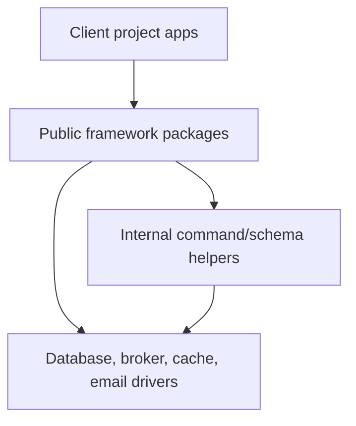
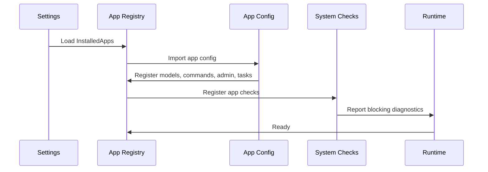
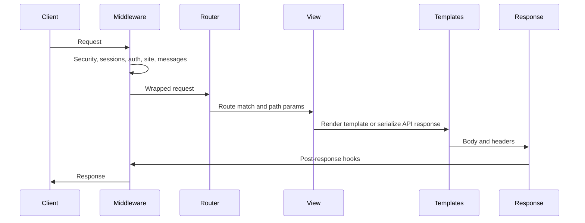
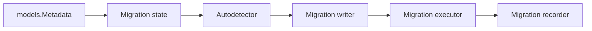
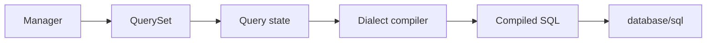
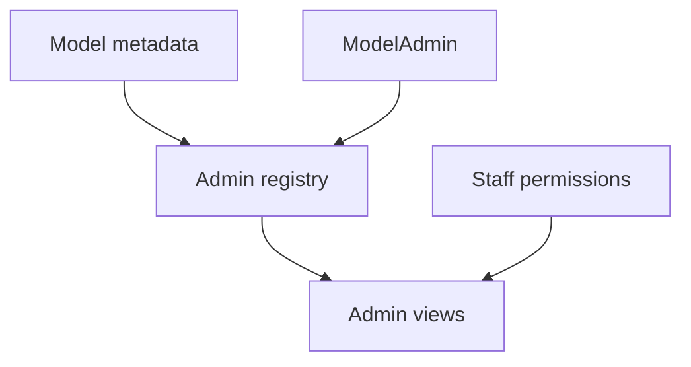
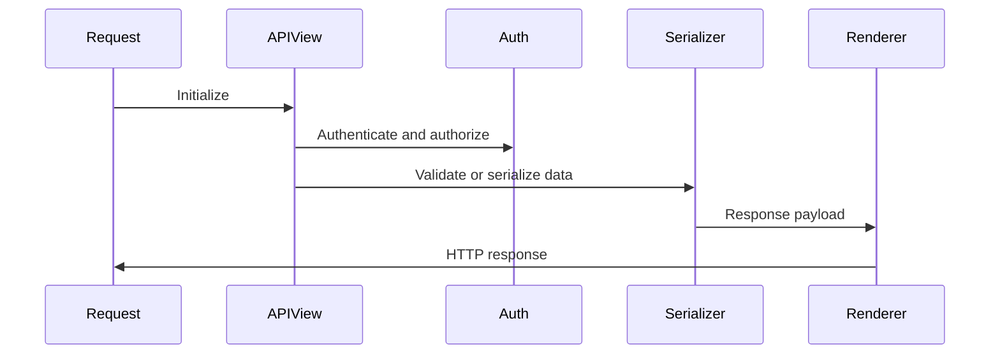
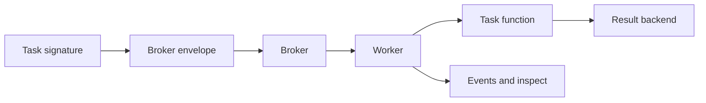

# Architecture Overview

Gogo is organized as a Django-style backend framework for Go. Applications are the unit of structure: each app owns models, migrations, admin registrations, API views, templates, static assets, queue tasks, checks, and optional contrib integrations.

## Package Layers

The framework is layered so client projects import public packages and avoid internal runtime packages.

Public packages include `app`, `conf`, `http`, `models`, `migrations`, `orm`, `auth`, `admin`, `api`, `queue`, `forms`, `templates`, `cache`, `email`, `files`, `sessions`, `security`, `checks`, `health`, `signals`, `contrib`, and `testing`.

## App Lifecycle

App startup follows the same lifecycle across project apps and contrib apps.

Each app config should keep side effects explicit. Model metadata, migrations, admin registration, API routes, template filters, and queue tasks should be discoverable through public app hooks.

## Request Lifecycle

HTTP requests pass through middleware, route resolution, view execution, response rendering, and optional post-response behavior.

Middleware order is deterministic. Security and host validation should run early. Sessions and auth should run before admin, API authentication, messages, flatpages, and redirects. Redirect middleware should run late because it inspects unresolved 404 responses.

## Model To Migration Flow

Model metadata is the source of truth for migrations.

The migration system compares historical project state with current model metadata, writes deterministic migration files, renders schema SQL through dialect-aware schema editors, applies operations, and records history checksums.

## ORM Query Flow

ORM query objects are immutable until compilation.

Managers expose named query entrypoints. QuerySets accumulate filters, ordering, annotations, joins, prefetches, locks, set operations, and write operations without mutating prior QuerySets. The compiler turns query state into SQL for the selected dialect.

## Admin Flow

Admin registration is metadata driven.

ModelAdmin stores list display, filters, search fields, actions, inlines, widgets, readonly fields, fieldsets, and permission hooks. Admin views enforce active staff access and use the same model, form, and ORM primitives available to project apps.

## API Flow

API views reuse request, auth, serializer, pagination, parser, renderer, filtering, throttling, and OpenAPI primitives.

ViewSets map actions to routes. Serializers own field conversion and validation. Renderers and parsers keep transport formats separate from business logic.

## Queue Flow

The queue layer follows Celery-style task dispatch and worker execution.

Queue apps register tasks by name. Signatures become envelopes with retry, routing, ETA, priority, chord, chain, and group metadata. Workers consume broker messages, enforce rate limits, timeouts, revocation, acknowledgement policy, retries, and result storage.

## Extension Rules

Extensions should use public APIs:

- Apps register through `app.Config` and registry hooks.
- Models expose `models.Metadata`.
- Database features go through dialect interfaces, ORM expressions, migrations, or contrib packages.
- Admin features go through `admin.ModelAdmin`, actions, widgets, and registry APIs.
- API features go through serializers, views, routers, parsers, renderers, auth, permissions, throttles, and OpenAPI metadata.
- Queue features go through task definitions, signatures, brokers, result backends, beat schedules, canvas primitives, events, and inspectors.
- Cross-cutting checks go through `checks.Registry`.

Avoid importing internal command or schema packages from client apps. If a missing extension point requires internal access, add a public boundary first.
