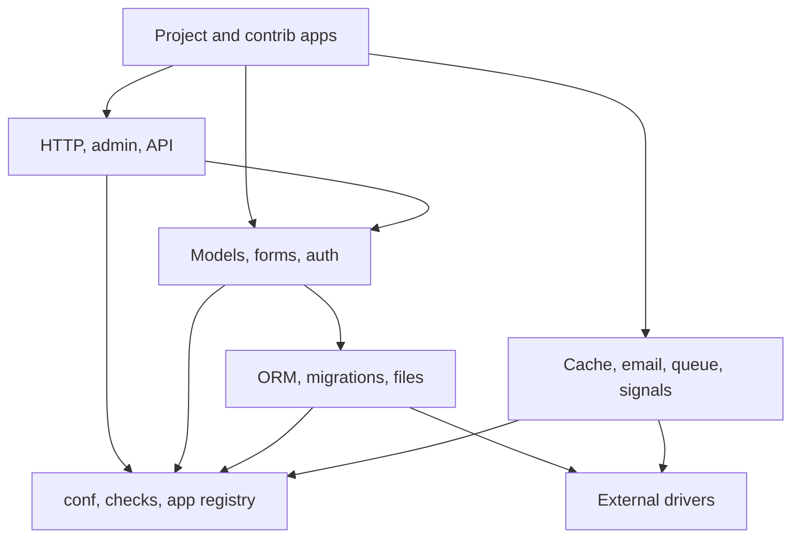

# Package Boundaries

This document defines how packages depend on each other and where client projects should extend the framework.

## Client Import Rules

Client applications may import public packages under `github.com/cybersaksham/gogo/...`. Client applications must not import packages under `internal/`.

Allowed client-facing package groups:

- Project lifecycle: `app`, `conf`, `checks`, `health`
- HTTP surface: `http`, `security`, `sessions`, `messages`
- Data model: `models`, `migrations`, `orm`, `files`
- User surface: `auth`, `admin`, `forms`, `templates`, `static`
- API surface: `api`
- Background work: `queue`
- Services: `cache`, `email`, `signals`
- Optional batteries: `contrib/...`
- Test support: `testing`

## Dependency Direction

Dependencies point inward toward smaller primitives and outward only through interfaces.

Packages should depend on interfaces where possible. Drivers, brokers, result backends, storage backends, email backends, cache stores, and database handles must stay behind public contracts.

## Core Boundaries

`conf` owns settings and environment parsing. It does not import application packages.

`app` owns app configuration, registry lifecycle, discovery hooks, ready hooks, shutdown hooks, and resource manifests.

`checks` owns diagnostics and check registration. Checks should report actionable IDs, severity, tags, hints, and object references without mutating runtime state.

`health` owns readiness and liveness checks for databases, caches, queues, storage, and custom services.

## Request Boundaries

`http` owns routing, middleware composition, request wrappers, responses, redirects, errors, generic views, and built-in request middleware.

`sessions`, `auth`, `messages`, `security`, and `contrib` middleware wrap `http` handlers through normal middleware contracts.

Views should not reach into app registry internals. They receive request context and call public model, form, API, admin, template, queue, and service APIs.

## Model And Migration Boundaries

`models` owns model metadata, field metadata, validation contracts, relation metadata, index metadata, constraint metadata, and registry metadata.

`migrations` owns migration graph, state, operations, writer, recorder, executor, autodetector, optimizer, and safety checks.

`orm` owns database connections, routers, query state, managers, QuerySets, expressions, lookups, functions, aggregates, transactions, raw SQL safety, dialects, joins, prefetches, and compiler output.

Schema SQL rendering belongs behind migration operations and schema editors. Query SQL rendering belongs behind ORM compilers.

## Admin Boundaries

`admin` owns admin sites, model admin registration, permissions, forms, widgets, inlines, actions, filters, search, change lists, change forms, delete views, history, URLs, static assets, and custom admin views.

Admin code may consume `auth`, `forms`, `models`, `orm`, `templates`, `static`, `messages`, and `security` through public APIs. ModelAdmin hooks are the extension point for project-specific behavior.

## API Boundaries

`api` owns request parsing, response rendering, serializers, serializer fields, validation, view classes, ViewSets, routers, authentication, permissions, throttling, filtering, pagination, uploads, metadata, versioning, and OpenAPI generation.

API code should not bypass serializers for validation or OpenAPI metadata. Authentication and permission classes should be composed through public hooks.

## Queue Boundaries

`queue` owns task registration, signatures, envelopes, retry policy, worker execution, beat schedules, brokers, result backends, routing, rate limits, pools, events, inspectors, admin metadata, and canvas primitives.

Task functions are app-owned. Brokers and result backends are infrastructure-owned. Workers only interact with tasks through the app task registry and with infrastructure through broker/backend interfaces.

## Contrib Boundaries

Contrib apps live under `contrib/` and must use the same public framework APIs available to client apps. They should register models, migrations, admin metadata, views, middleware, template filters, checks, SQL helpers, and tests without private hooks.

## Testing Boundaries

`testing` owns public test helpers for HTTP clients, temporary databases, settings overrides, fixtures, outboxes, eager queues, admin clients, and assertions.

Test helpers may wrap public framework APIs but should not create hidden production behavior. Anything required outside tests belongs in a normal public package.

## Extension Checklist

Before adding a new feature:

- Put the feature in the smallest public package that owns the behavior.
- Prefer an interface when the implementation depends on a database, cache, broker, filesystem, SMTP service, or external driver.
- Keep app code out of `internal/`.
- Add a system check for configuration or dependency failures.
- Add documentation showing the client import path and extension hook.
- Add tests through public APIs first.
